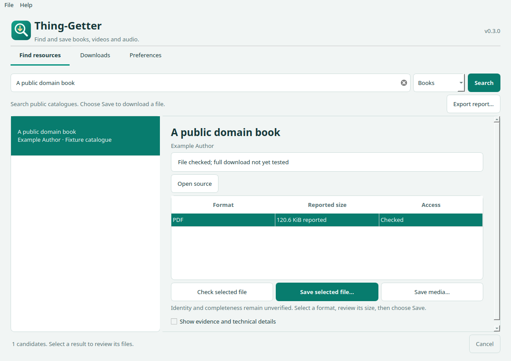

# Thing-Getter


A desktop app for finding, inspecting and saving books, videos and audio. Search public catalogues, check available formats and sizes, then save a file through a native dialog. Python and the media backend are included in the desktop downloads.

**[Download the latest release](https://github.com/SkanderBog/Thing-Getter/releases/latest)** · [Installation](docs/INSTALL.md) · [Privacy](docs/PRIVACY.md) · [Verification](docs/VERIFICATION.md) · [Build and test](docs/DEVELOPMENT.md)



## Using the app

1. Enter a title, author or topic, choose a resource type, and press **Search**. You can also paste a URL; select the media-page option for video/audio pages.
2. Choose a result. **Open source** visits its catalogue page. Select a file to see its reported format, size and access status.
3. **Check selected file** probes its response. **Save selected file** opens a save dialog. **Save media** uses the bundled extractor for supported video/audio pages.
4. Watch progress or cancel. Completed downloads appear under **Downloads**, where you can open the file or its folder.

Preferences include light/dark/system appearance, a download size limit, and an optional SearXNG endpoint. A network setting supports trusted proxies that resolve public sites to fake IP addresses; leave it off on ordinary networks.

The app searches Internet Archive, Open Library and Gutenberg via Gutendex. It distinguishes catalogue entries, restricted access, media metadata and observed file bytes. A successful download records a SHA-256 hash and provenance; it does not establish the right edition, complete content or permission to redistribute it. Downloads preserve existing files. Cancelled direct downloads retain partial files for a later validated resume to the same filename.

Search is limited to the configured sources. A supported media site may still require authentication or an external JavaScript runtime; the app does not bypass DRM, login, CAPTCHA or regional restrictions. Media selection uses a single playable format, avoiding a required FFmpeg installation; some sites offer fewer formats as a result. Search terms and requested URLs are sent to the chosen sources. No telemetry is included.

## Source / CLI

Requires Python 3.11 or later (desktop builds use Python 3.12).

```sh
python -m venv .venv
# Activate .venv using your shell's normal activation command.
python -m pip install -e '.[desktop]'
thing-getter
```

The original `resource-scout` CLI is retained:

```sh
resource-scout search "Pride and Prejudice" --kind book --html report.html --json report.json
resource-scout download --from-report report.json --result 1 --file 1 --out book.epub
resource-scout --help
```

Linux/macOS source checkouts also provide `./scout`. See [development instructions](docs/DEVELOPMENT.md) for tests and native packaging.

MIT-licensed application and original icon. Third-party components retain their own licenses; see [notices](THIRD_PARTY_NOTICES.md). Release packages are unsigned and macOS apps are not notarized.
